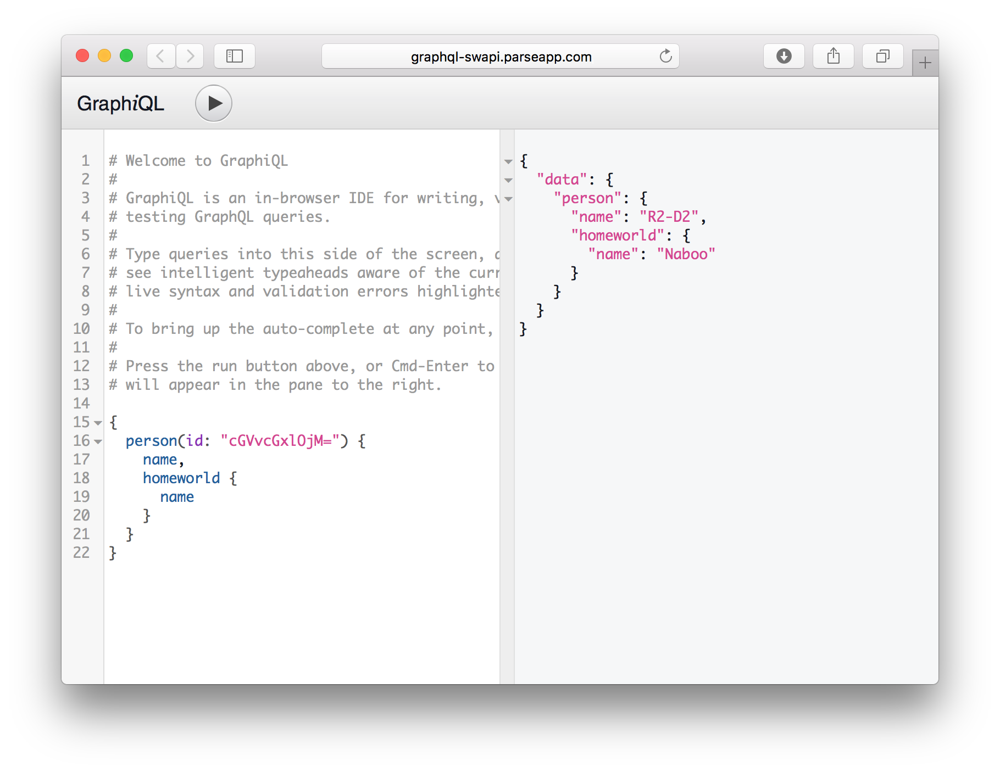

GraphiQL
========

*/ˈɡrafək(ə)l/* An graphical interactive in-browser GraphQL IDE. [Try the live demo](http://graphql-swapi.parseapp.com/).

[](https://travis-ci.org/graphql/graphiql)



### Getting started

Using a node.js server? Just use [`express-graphql`](https://github.com/graphql/express-graphql)!
It can automatically present GraphiQL. Using another GraphQL service? GraphiQL is pretty easy to set up.

```
npm install --save graphiql
```

GraphiQL provides a React component responsible for rendering the UI, which
should be provided with a function for fetching from GraphQL, we recommend using
the [fetch](https://fetch.spec.whatwg.org/) standard API.

```js
import React from 'react';
import ReactDOM from 'react-dom';
import GraphiQL from 'graphiql';
import fetch from 'isomorphic-fetch';

function graphQLFetcher(graphQLParams) {
  return fetch(window.location.origin + '/graphql', {
    method: 'post',
    headers: { 'Content-Type': 'application/json' },
    body: JSON.stringify(graphQLParams),
  }).then(response => response.json());
}

ReactDOM.render(<GraphiQL fetcher={graphQLFetcher} />, document.body);
```

Build for the web with [webpack](http://webpack.github.io/) or
[browserify](http://browserify.org/), or use the pre-bundled graphiql.js file.
See the example in the git repository to see how to use the pre-bundled file.


### Features

* Syntax highlighting
* Intelligent type ahead of fields, arguments, types, and more.
* Real-time error highlighting and reporting.
* Automatic query completion.
* Run and inspect query results


### Usage

GraphiQL exports a single React component which is intended to encompass the
entire browser viewport. This React component renders the GraphiQL editor.

```js
import GraphiQL from 'graphiql';

<GraphiQL />
```

GraphiQL supports customization in UI and behavior by accepting React props
and children.

**Props:**

- `fetcher`: a function which accepts GraphQL-HTTP parameters and returns
  a Promise which resolves to the GraphQL parsed JSON response.

- `schema`: a GraphQLSchema instance or `null` if one is not to be used.
  If `undefined` is provided, GraphiQL will send an introspection query
  using the fetcher to produce a schema.

- `query`: an optional GraphQL string to use as the initial displayed query,
  if `undefined` is provided, the stored query or defaultQuery will
  be used.

- `variables`: an optional GraphQL string to use as the initial displayed
  query variables, if `undefined` is provided, the stored variables will
  be used.

- `response`: an optional JSON string to use as the initial displayed
  response. If not provided, no response will be initialy shown. You might
  provide this if illustrating the result of the initial query.

- `storage`: an instance of [Storage][] GraphiQL will use to persist state.
  Only `getItem` and `setItem` are called. Default: window.localStorage

- `defaultQuery`: an optional GraphQL string to use when no query is provided
  and no stored query exists from a previous session. If `undefined` is
  provided, GraphiQL will use its own default query.

- `onEditQuery`: an optional function which will be called when the Query
  editor changes. The argument to the function will be the query string.

- `onEditVariables`: an optional function which will be called when the Query
  varible editor changes. The argument to the function will be the
  variables string.

- `getDefaultFieldNames`: an optional function used to provide default fields
  to non-leaf fields which invalidly lack a selection set.
  Accepts a GraphQLType instance and returns an array of field names.
  If not provided, a default behavior will be used.

**Children:**

* `<GraphiQL.Logo>`: Replace the GraphiQL logo with your own.

* `<GraphiQL.Toolbar>`: Add a custom toolbar above GraphiQL.

* `<GraphiQL.ToolbarButton>`: Add a button to the toolbar above GraphiQL.

* `<GraphiQL.Footer>`: Add a custom footer below GraphiQL Results.
