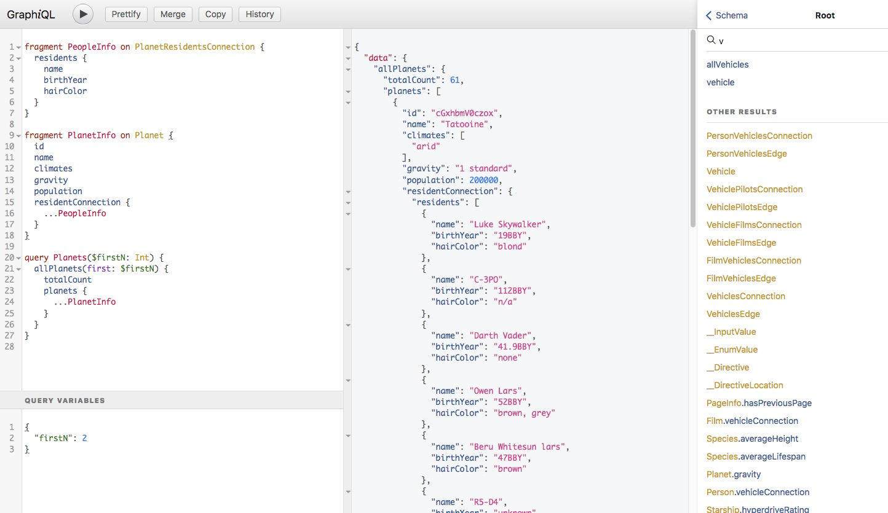

<!-- @format -->

# GraphQL IDE Monorepo

> **Security Notice:** All versions of `graphiql` < `1.4.7` are vulnerable to an XSS attack in cases where the GraphQL server to which the GraphiQL web app connects is not trusted. Learn more [in the graphiql `security` docs directory](docs/security)

> **Looking for the [GraphiQL Docs?](packages/graphiql/README.md)**: This is the root of the monorepo! The full GraphiQL docs are located at [`packages/graphiql`](packages/graphiql)

[](https://github.com/graphql/graphiql/actions?query=workflow%3A%22Node.JS+CI%22)
[](https://discord.gg/NP5vbPeUFp)
[](https://codecov.io/gh/graphql/graphiql)


[](https://snyk.io/test/github/graphql/graphiql)


[](https://bestpractices.coreinfrastructure.org/projects/3887)

## Overview

GraphiQL is the reference implementation of this monorepo, GraphQL IDE, an official project under the GraphQL Foundation. The code uses the permissive MIT license.

Whether you want a simple GraphiQL IDE instance for your server, or a more advanced web or desktop GraphQL IDE experience for your framework or plugin, or you want to build an IDE extension or plugin, you've come to the right place!

The purpose of this monorepo is to give the GraphQL Community:

- a to-specification official language service (see: [API Docs](https://graphiql-test.netlify.app/typedoc))
- a comprehensive LSP server and CLI service for use with IDEs
- a codemirror mode
- a monaco mode (in the works)
- an example of how to use this ecosystem with GraphiQL.
- examples of how to implement or extend GraphiQL.

## [`graphiql`](packages/graphiql#readme)

<!-- prettier-ignore -->
> [](https://npmjs.com/graphiql)
> 
> 
> 
> 
> 



_/ˈɡrafək(ə)l/_ A graphical interactive in-browser GraphQL IDE. [Try the live demo](http://graphql.org/swapi-graphql). We also have [a demo using our latest netlify build](http://graphiql-test.netlify.com) for the `main` branch.

The GraphiQL IDE, implemented in React, currently using [GraphQL mode for CodeMirror](packages/codemirror-graphql#readme) & [GraphQL Language Service](packages/graphql-language-service#readme).

**Learn more about [GraphiQL in `packages/graphiql/README.md`](packages/graphiql#readme)**

## [`monaco-graphql`](packages/monaco-graphql#readme)

[](https://npmjs.com/monaco-graphql)


Provides monaco editor with a powerful, schema-driven graphql language mode.

See the [webpack example](examples/monaco-graphql-webpack#readme) for a plain javascript demo using GitHub API

## [`codemirror-graphql`](packages/codemirror-graphql#readme)

[](https://npmjs.com/codemirror-graphql)


Provides CodeMirror with a parser mode for GraphQL along with a live linter and typeahead hinter powered by your GraphQL Schema

## [`graphql-language-service`](packages/graphql-language-service#readme)

[](https://npmjs.com/graphql-language-service)


Provides language services for [`graphql-language-service-server`](packages/graphql-language-service-server#readme) [`codemirror-graphql`](packages/codemirror-graphql) and [`monaco-graphql`](packages/monaco-graphql).

## [`graphql-language-service-server`](packages/graphql-language-service-server#readme)

[](https://npmjs.com/graphql-language-service-server)


Provides language services for LSP-based IDE extensions

## [`graphql-language-service-server-cli`](packages/graphql-language-service-server-cli#readme)

[](https://npmjs.com/graphql-language-service-server-cli)


Provides a CLI for the language service server

## Browser & Runtime Support

Many of these packages need to work in multiple environments.

By default, all typescript packages target `es6`.

`graphql-language-service-server` and `graphql-language-service-cli` are made for the node runtime, so they target `es2017`

`codemirror-graphql` and the `graphiql` browser bundle use the [`.browserslistrc`](./.browserslistrc), which targets modern browsers to keep bundle size small and keep the language services performant where async/await is used, and especially to avoid the requirement of `regenerator-runtime` or special babel configuration.

### [`.browserslistrc`](./.browserslistrc):

```
last 2 versions
Firefox ESR
not dead
not IE 11
not ios 10
maintained node versions
```

To be clear, we do _not_ support Internet Explorer or older versions of evergreen browsers.

## Development

To get setup for local development of this monorepo, refer to [DEVELOPMENT.md](./DEVELOPMENT.md)

# Contributing to this repo

This is an open source project, and we welcome contributions. Please see
[CONTRIBUTING.md](CONTRIBUTING.md) for details on how to contribute.

This repository is managed by EasyCLA. Project participants must sign the free [GraphQL Specification Membership agreement](https://preview-spec-membership.graphql.org) before making a contribution. You only need to do this one time, and it can be signed by [individual contributors](http://individual-spec-membership.graphql.org/) or their [employers](http://corporate-spec-membership.graphql.org/).

To initiate the signature process please open a PR against this repo. The EasyCLA bot will block the merge if we still need a membership agreement from you.

Please note that EasyCLA is configured to accept commits from certain GitHub bots. These are approved on an exception basis once we are confident that any content they create is either unlikely to consist of copyrightable content or else was written by someone who has already signed the CLA (e.g., a project maintainer). The bots that have currently been approved as exceptions are:

- github-actions (exclusively for the `changesets` Action)

You can find [detailed information here](https://github.com/graphql/graphql-wg/tree/main/membership). If you have issues, please email [operations@graphql.org](mailto:operations@graphql.org).

## Maintainers

Maintainers of this repository regularly review PRs and issues and help advance the GraphiQL roadmap

### Alumni

Without these amazing past maintainers, where would we be?!

- [@leebyron](https://github.com/leebyron) - original author of all libraries
- [@asiandrummer](https://github.com/asiandrummer) - original creator of GraphiQL
- [@wincent](https://github.com/wincent) - early co-author and maintainer
- [@lostplan](https://github.com/lostplan) - maintained the language service ecosystem until about 2017
- [@IvanGoncharov](https://github.com/ivangoncharov) - maintainer and transitional mentor to @acao and others
- [@orta](https://github.com/orta) - has helped with so many parts of the project over the years, and provided the original redesign!
- [@divyenduz](https://github.com/divyenduz) - the original creator of `vscode-graphql`, and contributor to much of the ecosystem. Thanks Divy!

### Active

Maintainers who are currently active (to varying degrees, please contact us via our discord channels!):

- [@imolorhe](https://github.com/imolorhe)
- [@yoshiakis](https://github.com/yoshiakis)
- [@urigo](https://github.com/urigo)
- [@timsuchanek](https://github.com/timsuchanek)
- [@thomasheyenbrock](https://github.com/thomasheyenbrock)
- [@n1ru4l](https://github.com/n1ru4l)
- [@acao](https://github.com/acao)
- [@stonexer](https://github.com/stonexer)
- [@B2o5T](https://github.com/B2o5T)
- [@dotansimha](https://github.com/dotansimha)
- [@saihaj](https://github.com/saihaj)
- [@jonathanawesome](https://github.com/jonathanawesome)

> Thank you graphql community for all the help & support! I did it all for you, and I couldn't have done it without you ❤️ - @acao

### Fielding Proposals!

The door is open for proposals for the new GraphiQL Plugin API, and other ideas on how to make the rest of the IDE ecosystem more performant, scalable, interoperable and extensible.
Feel free to open a PR to create a document in the `/proposals/` directory.
Eventually we hope to move these to a repo that serves this purpose.

## Community

- **Discord** [](https://discord.gg/NP5vbPeUFp) - Most discussion outside of github happens on the GraphQL [Discord Server](https://discord.gg/NP5vbPeUFp)
- **Twitter** - [@GraphiQL](https://twitter.com/@GraphiQL) and [#GraphiQL](https://twitter.com/hashtag/GraphiQL)
- **GitHub** - Create feature requests, discussions issues and bugs above
- **Working Group** - Yes, you're invited! Monthly planning/decision making meetings, and working sessions every two weeks on zoom! [Learn more.](working-group#readme)
