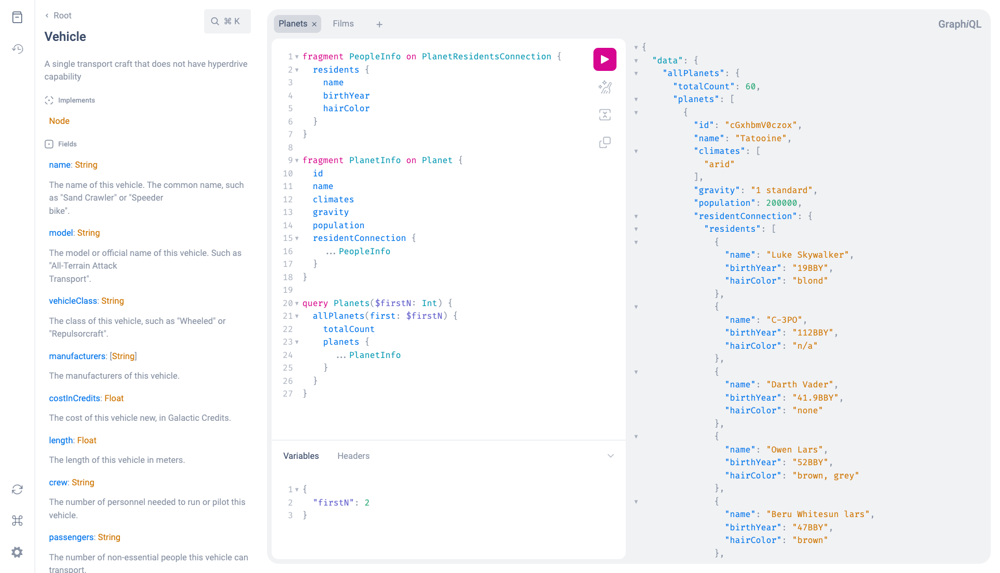

# GraphiQL

> **Security Notice:** All versions of `graphiql` < `1.4.3` are vulnerable to an
> XSS attack in cases where the GraphQL server to which the GraphiQL web app
> connects is not trusted. Learn more in
> [our security advisory](https://github.com/graphql/graphiql/tree/main/docs/security/2021-introspection-schema-xss.md).

[](https://npmjs.com/graphiql)


[](LICENSE)
[](https://discord.gg/NP5vbPeUFp)

_/ˈɡrafək(ə)l/_ A graphical interactive in-browser GraphQL IDE.
[Try the live demo](https://graphql.github.io/swapi-graphql).

[](https://graphql.github.io/swapi-graphql)

## Features

- Full language support of the latest
  [GraphQL Specification](https://spec.graphql.org/draft/#sec-Language):
- Syntax highlighting
- Intelligent type ahead of fields, arguments, types, and more
- Real-time error highlighting and reporting for queries and variables
- Automatic query and variables completion
- Automatic leaf node insertion for non-scalar fields
- Documentation explorer with search and markdown support
- Persisted state using `localStorage`
- Simple API for adding custom plugins

## Live Demos

- The [latest stable version](https://graphql.github.io/swapi-graphql)
- The current state of the `main` branch:
  - Using the [minified bundles](https://graphiql-test.netlify.com)
  - Using the [development bundles](https://graphiql-test.netlify.com/dev) (good
    for inspecting, debugging, etc)
- Each pull request will also get its own preview deployment on Netlify, you'll
  find a link in the GitHub checks

## Examples

- [`Unpkg (CDN)`](../../examples/graphiql-cdn) - A single HTML file using CDN
  assets and a script tag
- [`Webpack`](../../examples/graphiql-webpack) - A starter for Webpack
- [`Create React App`](../../examples/graphiql-create-react-app) - An example
  using [Create React App](https://create-react-app.dev)
- [`Parcel`](../../examples/graphiql-parcel) - An example using
  [Parcel](https://parceljs.org)

## Getting started

> If you're looking to upgrade from `graphiql@1.x` to `graphiql@2`, check out
> the [migration guide](../../docs/migration/graphiql-2.0.0.md)!

### UMD

With `unpkg`/`jsdelivr`, etc.:

```html
<link href="https://unpkg.com/graphiql/graphiql.min.css" rel="stylesheet" />
<script crossorigin src="https://unpkg.com/graphiql/graphiql.min.js"></script>
```

(see: Usage UMD Bundle below for more required script tags)

## Usage

### Using as package

The `graphiql` package can be installed using your favorite package manager. You
also need to have `react`,`react-dom` and `graphql` installed which are peer
dependencies of `graphiql`.

```sh
npm install graphiql react react-dom graphql
```

The package exports a bunch of React components:

- The `GraphiQLProvider` components renders multiple context providers that
  encapsulate all state management
- The `GraphiQLInterface` component renders the UI that makes up GraphiQL
- The `GraphiQL` component is a combination of both the above components

There is a single prop that is required for the `GraphiQL` component called
fetcher. A fetcher is a function that performs a request to a GraphQL API. It
may return a `Promise` for queries or mutations, but also an `Observable` or an
`AsyncIterable` in order to handle subscriptions or multipart responses.

An easy way to get create such a function is the
[`createGraphiQLFetcher`](../graphiql-toolkit/src/create-fetcher/createFetcher.ts)
method exported from the `@graphiql/toolkit` package. If you want to implement
your own fetcher function you can use the `Fetcher` type from
`@graphiql/toolkit` to make sure the signature matches what GraphiQL expects.

The following is everything you need to render GraphiQL in your React
application:

```jsx
import { createGraphiQLFetcher } from '@graphiql/toolkit';
import { GraphiQL } from 'graphiql';
import React from 'react';
import { createRoot } from 'react-dom/client';
import 'graphiql/graphiql.css';

const fetcher = createGraphiQLFetcher({ url: 'https://my.backend/graphql' });

const root = createRoot(document.getElementById('root'));
root.render(<GraphiQL fetcher={fetcher} />);
```

### Using as UMD bundle over CDN (Unpkg, JSDelivr, etc)

There exist pre-bundled static assets that allow you to easily render GraphiQL
just by putting together a single HTML file. Check out the `index.html` file in
the [example project](../../examples/graphiql-cdn) in this repository.

## Customize

GraphiQL supports customization in UI and behavior by accepting React props and
children.

### Props

For props documentation, see the
[API Docs](https://graphiql-test.netlify.app/typedoc/modules/graphiql.html#graphiqlprops-1)

### Children

Parts of the UI can be customized by passing children to the `GraphiQL` or the
`GraphiQLInterface` component.

- `<GraphiQL.Logo>`: Replace the GraphiQL logo with your own.

- `<GraphiQL.Toolbar>`: Add a custom toolbar below the execution button. Pass
  the empty `<GraphiQL.Toolbar />` if an empty toolbar is desired. Use the
  components provided by `@graphiql/react` to create toolbar buttons with proper
  styles.

- `<GraphiQL.Footer>`: Add a custom footer shown below the response editor.

### Plugins

Starting with `graphiql@2` there exists a simple plugin API that allows you to
build your own custom tools right into GraphiQL.

There are two built-in plugins that come with GraphiQL: The documentation
explorer and the query history. Both can be toggled using icons in the sidebar
on the left side of the screen. When opened, they appear next to the sidebar in
a resizable portion of the screen.

To define your own plugin, all you need is a JavaScript object with three
properties:

- `title`: A unique title for the plugin (this will show up in a tooltip when
  hovering over the sidebar icon)
- `icon`: A React component that renders an icon which will be included in the
  sidebar
- `content`: A React component that renders the plugin contents which will be
  shown next to the sidebar when opening the plugin

You can pass a list of plugin objects to the `GraphiQL` component using the
`plugins` prop. You can also control the visibility state of plugins using the
`visiblePlugin` prop and react to changes of the plugin visibility state using
the `onTogglePluginVisibility` prop.

Inside the component you pass to `content` you can interact with the GraphiQL
state using the hooks provided by `@graphiql/react`. For example, check out
how you can integrate the OneGraph Explorer in GraphiQL using the plugin API in
the [plugin package](../graphiql-plugin-explorer) in this repo.

### Theming

The GraphiQL interface uses CSS variables for theming, in particular for colors.
Check out the [`root.css`](../graphiql-react/src/style/root.css) file for the
available variables.

Overriding these variables is the only officially supported way of customizing
the appearance of GraphiQL. Starting from version 2, class names are no longer
be considered stable and might change between minor or patch version updates.

### Editor Theme

The colors inside the editor can also be altered using
[CodeMirror editor themes](https://codemirror.net/demo/theme.html). You can use
the `editorTheme` prop to pass in the name of the theme. The CSS for the theme
has to be loaded for the theme prop to work.

```jsx
// In your document head:
<link
  rel="stylesheet"
  href="https://cdnjs.cloudflare.com/ajax/libs/codemirror/5.23.0/theme/solarized.css"
/>
```

```jsx
// When rendering GraphiQL:
<GraphiQL editorTheme="solarized light" />
```

You can also create your own theme in CSS. As a reference, the default
`graphiql` theme definition can be found
[here](../graphiql-react/src/editor/style/codemirror.css).
